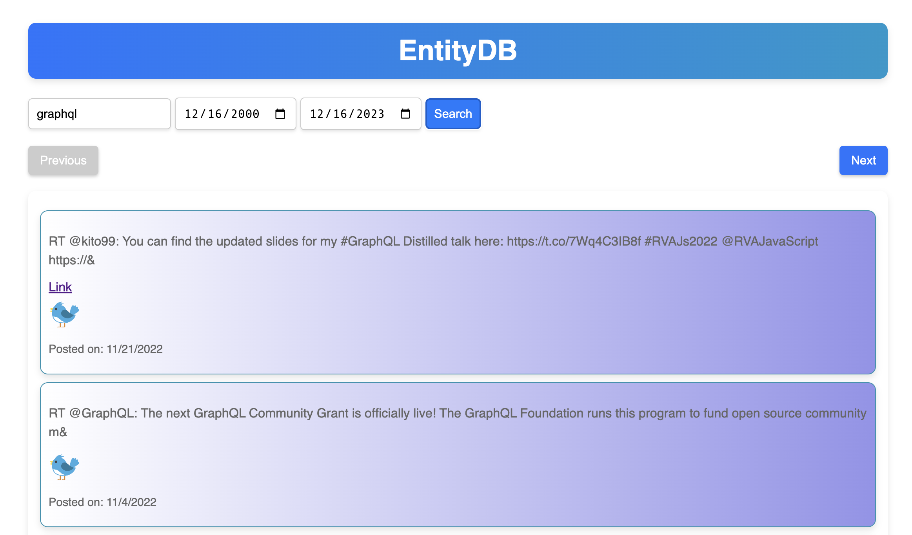

# EntityDB

This is a project I'm working on to better understand how to use generative AI to learn new technologies write code in response to detailed prompts.

The initial goal of the project was to import data from social networks Facebook, Instagram and Twitter into a database and then provide a unified view of the posts, tweets or images that you can page through and search.

I developed the project via a set of prompts you you can find in the [prompts](./prompts) directory.
Almost all of the code was written by ChatGPT-4.

## Overview

This project is written in Typescript and is made up of a number of components:

* Importers to import social media data into PostgreSQL tables:
  * Facebook importer.
  * Twitter importer.
  * Instagram importer.
* `./web-api` - GraphQL server that provides API access to the data (uses Apollo Server).
* `./web-ui` - Web UI that allows you to page and search through the data (Web components & Lit framework).
* `./web-static` - Web server that serves images from the social media data (Express and Webpack).

The rest of this doc gives an overview setting up and running this code.

## Download and unzip your social media data

Download your user data from Twitter, Facebook and Twitter.
Then create three directories under `web-static/data` named `instagram`, `facebook` and `twitter`.
Unzip the Facebook data into `facebook`, Twitter into `twitter` and Instagram into `instagram`.

## Import your data

Follow the instructions in the [IMPORTING_DATA.md](IMPORTING_DATA.md) doc.

## Start the GraphQL server

In one terminal window:

    cd web-api
    npm run generate
    npm run server

Once it is up running you can connect to it at http://localhost:4000, e.g. via Apollo Studio or your favorite GraphQL client.

## Start the static web server (for images)

In another terminal window:

    cd web-static
    npm run build
    npm run start

# Start the Web UI

    cd web-ui
    npm build:dev
    npm start:dev

Once it is up running you can connect to it at http://localhost:8080

## Screenshot 

